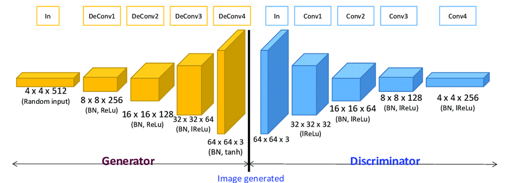

# PyTorch Mini Projects
> A collection of small-scale projects that helped me learn the basics of the PyTorch framework

## Project #1: Simple Neural Network on Fashion MNIST dataset

What I learned:
* Linear Layers
* Activation functions
* Optimizers
* The low-level logic of Network hidden layers
* Creating a model class
* Handling the GPU
* Neural Network training pipeline
* Neural Network performance evaluation

## Project #2: Residual Neural Networks on CIFAR10 dataset

What I learned:
* Data transformations
* Residual blocks
* Logic of ResNets
* Adam Optimizer
* One cycle policy learning rate scheduler
* Tuning ResNets

## Project 3: DCGANs on MNIST dataset

What I learned:
* Objectives of Discriminators and Generators
* Deconvolutions
* Using latent tensors or noise to generate fake outputs
* Loss function of the Generator
* Training pipeline of DCGANs
* Tuning DCGANs

### DCGAN Result:

